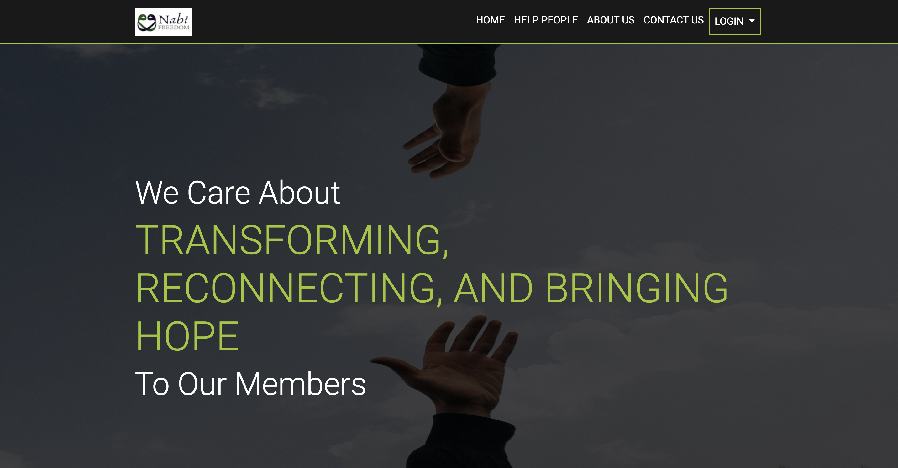
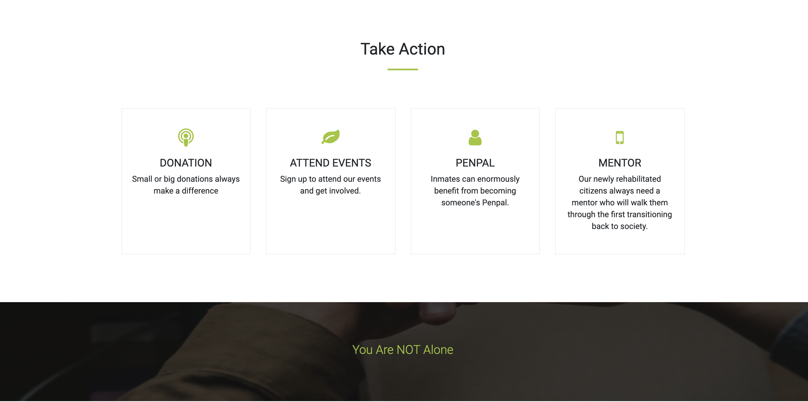
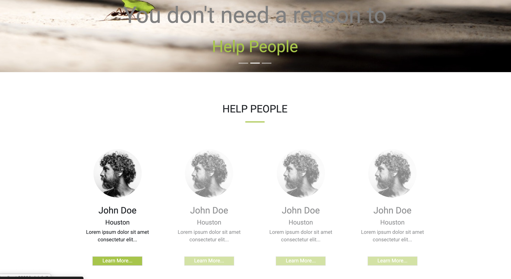
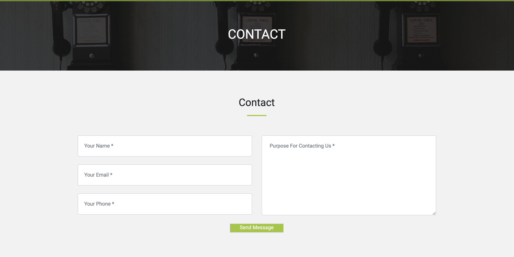
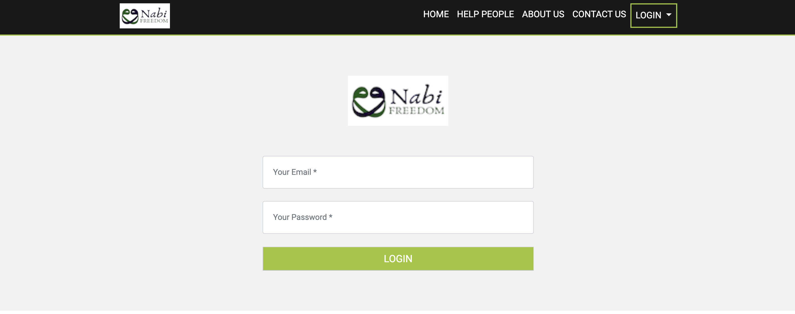
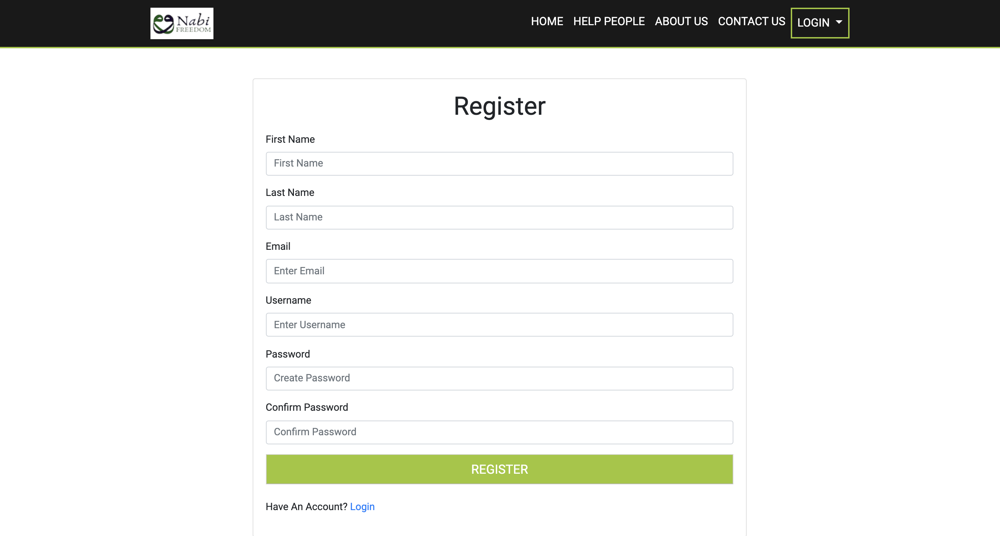
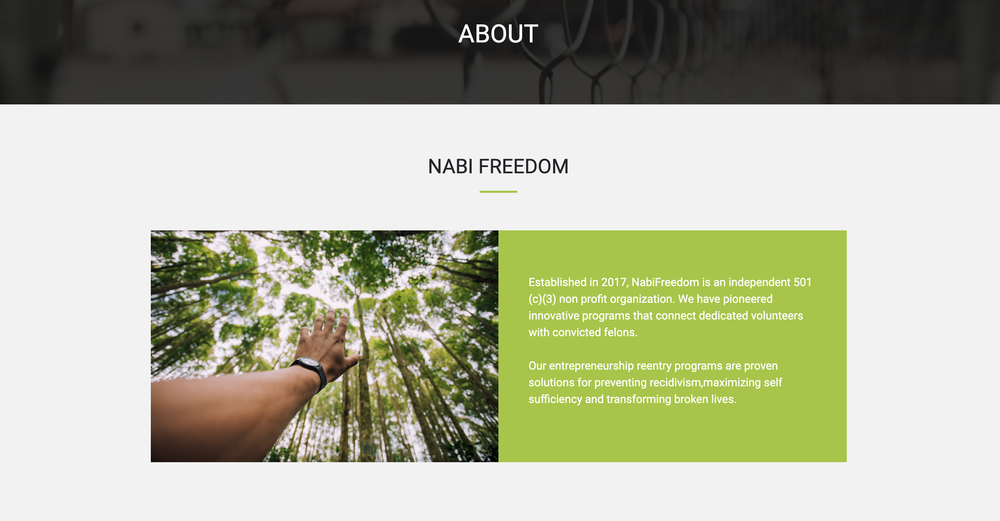

<h1>NABIFREEDOM</h1>


<h2> Let's make a world where everyone belongs somewhere. Feels beloved and belonged to the community, a place and a space you feel home! </h2>

## Table of contents
* [General info](#general-info)
* [Screenshots](#screenshots)
* [Technologies](#technologies)
* [Setup](#setup)
* [Features](#features)
* [Status](#status)
* [Inspiration](#inspiration)
* [Contact](#contact)


<h2>General Info:</h2>
<h2>Real project for a Non-Profit organization  </h2>

* <h2>Purpose of This Website:</h2>
<h3>This is a website for non-profit organization where it helps people in jail. We wanted to contribute to the community with what we can. Keeps track of who has been released, and what type of need they urge for, offers not only material help but also mentorship to get back to the community. </h3>

## Screenshots:


<h4>Home page .....</h4>

<h4>Take  page .....</h4>

<h4>Help people  page .....</h4>

<h4>Contact  page .....</h4>

<h4>Login  page .....</h4>

<h4>Register  page .....</h4>


<h4>About Us  page .....</h4>


## Technologies

* Bootstrap v4.0.0
* CSS3
* Node.js v12.13.1
* Sequelize v5.5.1

## Setup
<h4>To run this project, install it locally using npm:</h4>


```$ npm install express```


## Code Examples

```bash
const express = require('express');
const session = require('express-session');
const db = require('./models');
const bodyParser = require('body-parser');
const app = express();
let cookieParser = require('cookie-parser');
```